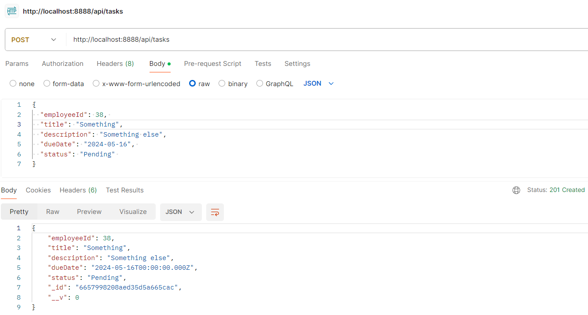
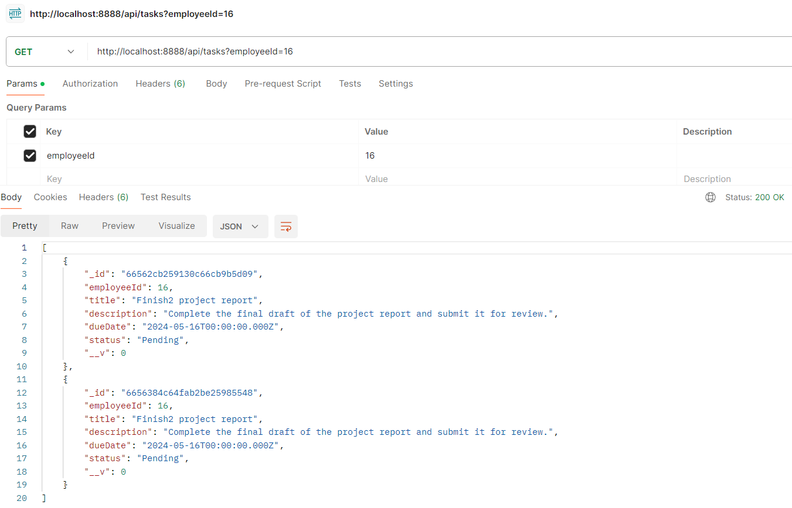
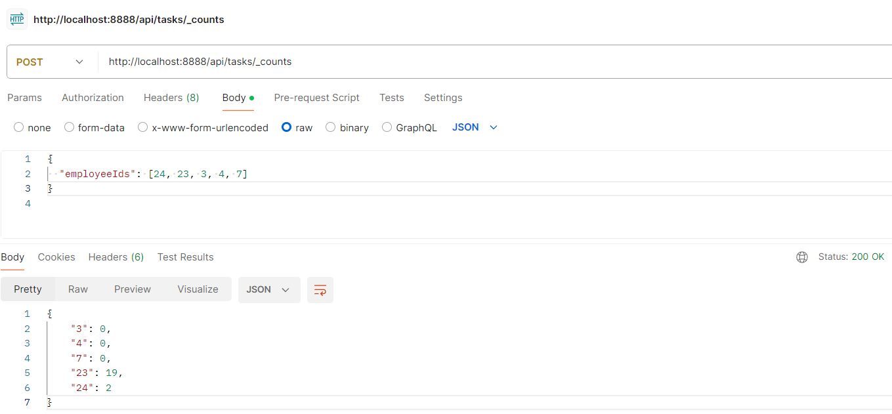

# Tasks Service
This is an example Node.js project using TypeScript, Consul, Express, Mongoose, and Mocha, which comprises the Tasks service. It's designed to interact with two entities: Employee and Tasks, utilizing MongoDB as its database.

# Endpoints
```
POST /api/tasks (Creates a new Task entity.)
```
- Validates mandatory fields and their formats.
- Automatically sets the time field if it's absent in the request.
- Requires the ID of Employee within the JSON request object.
- Validates the existence of the corresponding Employee object by querying the service developed in Task 2.



---
```
GET /api/tasks (Returns a list of Task entities associated with a single Employee entity, sorted in descending order of time (latest first).)
```

- Query Parameters
- employeeId: Required ID of Employee.
- size: Maximum number of objects to be returned in the response.
- from: Starting index of the selection.


---

```
POST /api/tasks/_counts (Accepts an array of Employee IDs and returns the total count of Task elements associated with each Employee ID.)
```


# How to run "for the prod"

Just execute `docker-compose up`

It will run all services in containers (nodejs-sample, db and consul).
Once consul is running, all key-values will be added automatically.
Once consul and db are running, nodejs-sample will be started.

After that you can check the service by calling
GET: `http://localhost:8888/ping`
response will be `PONG`

All consul kv's and mongoDB data will be stored in docker/data/...
Thus, when the containers are restarted, data will not be lost.

# Configuration

If for some reason consul kv's were not added, and you need to add it manually:

Open consul ui (by default `localhost:8501`)
Add to consul these key-values:

for "prod" version

`config/nodejs-sample/prod/address` : `0.0.0.0`

`config/nodejs-sample/prod/port` : `8888`

`config/nodejs-sample/prod/mongo.address` : `mongodb://db:27017`


for "dev" version

`config/nodejs-sample/dev/address` : `localhost`

`config/nodejs-sample/dev/port` : `8888`

`config/nodejs-sample/dev/mongo.address` : `mongodb://127.0.0.1:27018`


run nodejs-sample again

# Setup
Run `npm install` in the terminal

# How to run for the prod

When consul and mongoDB containers are running
```
npm run start
```

If everything is fine, you will see:
"Example app listening on port localhost:8888"

# How to develop

```
npm run devel
```

# How to build

```
npm run build
```

# How to run tests

```
npm run test
```

If everything is fine, you should see the list of passed tests

# How to check coverage

```
npm run coverage
```
If everything is fine, you should see the table with coverage after passed tests
